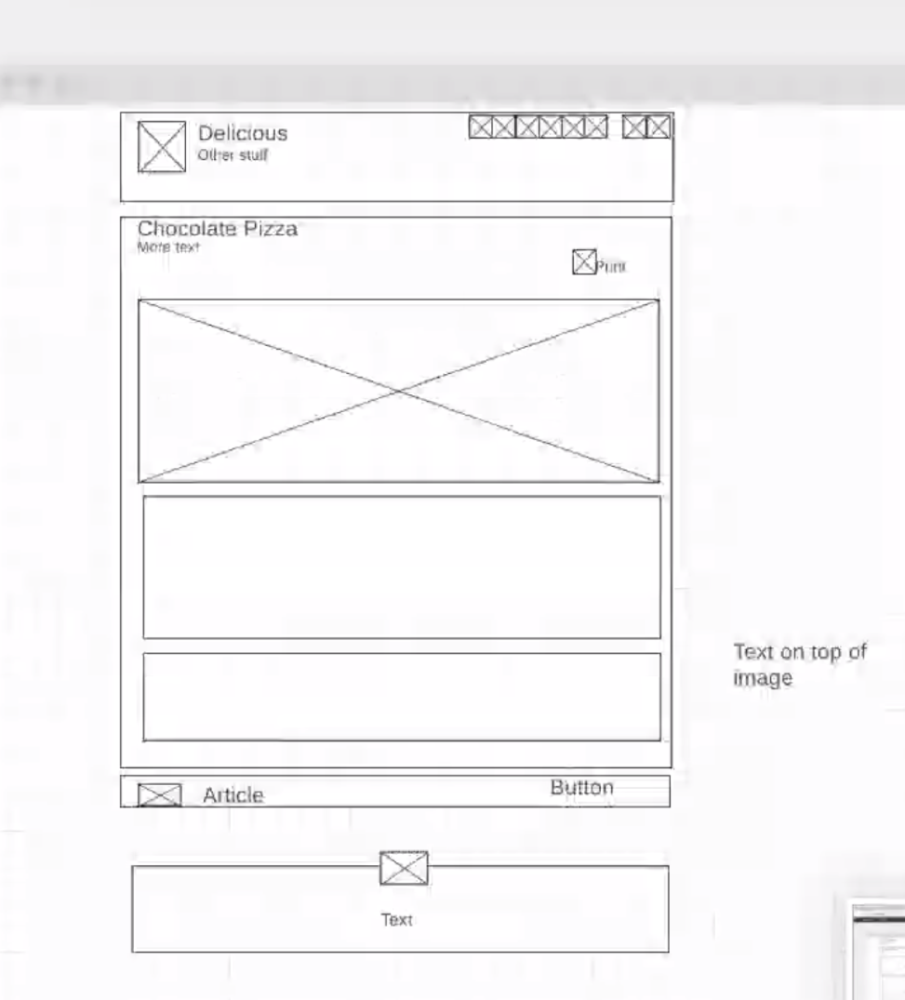

# chocolate-pizza
Lab 10 assignment

We spent a good amount of time talking through our wireframe before we got started with HTML structure, which we both found really helpful (see below for screenshot). Then Courtney navigated HTML while Tia drove, we then did a PR and merged. Courtney pulled back down master and Tia navigated CSS while Courtney drove. We struggled a bit with the "image border" but learned a lot from each other during the pair programming process.

## Author: Courtney Hans & Tia Low
Thanks to Alistair for some nav help

## Links and Resources
WS3
CSS tricks

## Reflections and Comments

Our CSS skills have "opportunity" but we're getting better all the time - growth mindset!